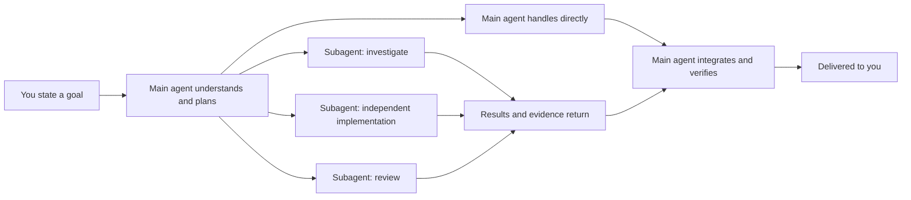

# Agent collaboration and subagents

When a task is large, the main agent can hand a clearly bounded piece of work to a
subagent, keep coordinating the rest itself, and finally integrate and check the
results.

You only state the goal and constraints. The main agent decides whether splitting is
worth it; simple or tightly coupled tasks are done directly by the main agent.

## What the main agent and subagents each do

- The **main agent** receives your goal, maintains the overall plan, decides how to
  split the work, and owns the final answer.
- A **subagent** has its own model context and focuses on a task with a clear scope and
  deliverable, such as locating code, researching external material, implementing an
  independent module, or reviewing results.
- The **main agent integrates.** After a subagent returns its results, the main agent
  checks the evidence, resolves conflicts, runs necessary verification, and then
  reports the outcome of the whole task to you.

## When splitting makes sense

Subagents suit work that can be described and checked on its own:

- surveying several independent modules at once;
- checking the local implementation while researching upstream documentation;
- handing a well-bounded implementation to an independent workspace;
- asking a fresh context for a second opinion when the main agent has tried several
  times without certainty;
- after an implementation, having another context look specifically for what was
  missed.

If the next step depends on details that just came up, changes keep touching the same
set of files, or the task is very small, splitting adds communication and merge cost.
In those cases the main agent should stay in the current context and finish it.

## Context and file isolation

"Independent context" and "independent file directory" are two different things:

1. **Fresh context** starts from a clear task brief and does not inherit the whole
   main conversation; it suits research, review, and avoiding old assumptions that
   could bias judgment.
2. **Fork from the current conversation** inherits the existing context; it suits work
   that needs a lot of background but can proceed independently in the background.
3. **Independent worktree** changes files in a separate Git worktree; it suits
   implementations with a larger scope that may write in parallel with the main line,
   or that need a safe place to experiment.

Subagents do not automatically have an independent worktree. Multiple agents writing
files in the same workspace can still overwrite each other, so the main agent should
draw clear file ownership; when uncertain or when changes are broad, prefer
isolation.

## Foreground waits and background collaboration

The main agent can wait for a subagent to return before continuing, or let it run in
the background:

- **Wait for the result:** suits cases where the main agent's next step depends on it.
- **Run in the background:** suits independent investigations or implementations. The
  main agent can do other work at the same time; when the subagent finishes, the system
  sends a completion notice instead of requiring repeated status checks.

The main agent chooses this per task with `run_in_background`. Background is the
default. When the next step depends on a child, the main agent sets it to `false`; the
current tool call then waits and receives the child's terminal state, final output, and
error directly. A foreground wait becomes background after ten minutes so a slow or
stuck child cannot block the parent indefinitely.

The Subagent plugin contributes subtask state for the current parent session above the
Composer. Background completions arrive as ordinary read-only query bubbles. A bubble
only shows a summary such as "subtask A has updated"; the full handoff prompt goes only
to the model input. A foreground completion returns through the existing tool call and
does not create a duplicate completion bubble. Persisted records keep the plugin source
and cause. Disabling the plugin withdraws the status slots, tools, prompts, and
completion subscriptions together.

Stopping the main session's current reply is not disguised as product-specific control
of sub-sessions. To terminate a subtask, the main agent uses the Subagent plugin's
`close_agent`, which runs through the public Session cancel; to add requirements it
uses `send_message`.

## How this differs from the other two kinds of background work

| Capability | Solves what | Who continues the work | When it ends |
| --- | --- | --- | --- |
| Subagents | Parallel thinking, investigation, implementation, or review | Another agent context | Subtask completes, fails, or is cancelled |
| [Background commands](../reference/agent-command-system.md) | Running tests, dev servers, downloads, or interactive programs | A local process | Process exits or is stopped |
| [Automations](../automation/scheduled-tasks.md) | Starting a task on a schedule in the future | The Automation plugin's Timer delivers an ordinary query to the session at that time | A single run ends, or a recurring task is paused or deleted |

These three capabilities run independently and handle agent collaboration, local
processes, and scheduled dispatch respectively.

## Models, permissions, and cost

- Subagents still run inside the current Wuu permission and workspace boundary; being
  split out does not bypass local protections.
- Wuu can assign a separately configured model alias to a subagent; when none is
  specified, the current worker's default model is used.
- Each subagent has its own model context and calls, so parallel work usually increases
  model requests and token consumption.
- What a subagent returns is a deliverable to verify, not an automatically trusted
  conclusion. For code and external material, the main agent should keep checkable
  file, command, or link evidence.

## Current usage boundaries

- The current desktop experience centers on the main agent deciding automatically
  whether to delegate; there is no `@agent` interaction for naming a subagent manually
  or switching the main agent.
- The Subagent plugin provides an A+ proactive-delegation switch in the Composer
  toolbar; it only changes the plugin prompt for subsequent model requests, and does
  not save a mode in the core or modify an executing turn.
- Subagents are for bounded temporary tasks, each running around a clear task and
  deliverable.
- When Wuu closes, the runtime restarts, or the machine goes offline, an executing
  subagent may be interrupted.
- After a subagent finishes, the workspace files, diff, and verification results are
  still the basis for the final outcome.

To understand how the commands a subagent may start are hosted, continue with
[commands and background tasks](../reference/agent-command-system.md).

Named-agent group chat is another way to collaborate: named agents with persistent
memory discuss with people in channels over time. See [group chat and named-agent
collaboration](collaboration.md).
