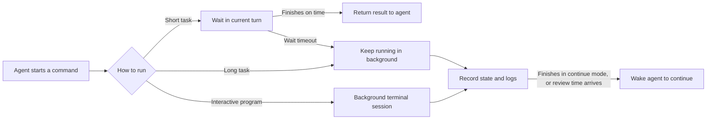

# Commands and background tasks

When you ask Wuu to "run the tests", "start the dev server", or "execute this script",
Wuu chooses how to run it based on the command's runtime and interaction needs, and
keeps recording the process state and output.

This page describes the local processes the agent starts, including ordinary commands,
background tasks, and interactive programs. The concrete tool names, parameters, and
source indexes are at the end.

## Command types

Wuu divides commands into three kinds:

1. **Commands that finish quickly**, such as checking Git status, running one test, or
   completing a build. The agent stays in the current working turn and waits for the
   result.
2. **Tasks that need to keep running**, such as a dev server, watch mode, or a large
   download. Wuu registers them as background tasks and the agent can do other things.
3. **Programs that need human interaction**, such as an installer confirmation, a
   login prompt, or a REPL. Wuu keeps writable input for them and provides a real
   terminal session on supported platforms.

All three kinds enter through the same command entry point and share process-tree
control and logging. An ordinary command runs within the current turn; after it
exceeds the wait limit, Wuu registers the still-running process with the background
task manager instead of running it again.



## What an ordinary command goes through

Using "run the tests for the current module" as an example, the full process is:

1. **The model proposes an action.** The model states what to run, in which directory,
   and whether this run is a local or full check.
2. **Wuu decides whether it may run.** The system checks whether the current agent has
   command capability, whether the directory is inside a reachable workspace, whether
   read-only mode allows the action, and flags obviously sensitive or destructive
   commands.
3. **A separate process tree is created.** The command and its child processes are
   isolated from Wuu itself. Even if the test framework later spawns more workers, Wuu
   can stop the whole process tree together.
4. **Wait and collect the result.** Wuu records the exit code, duration, standard
   output, standard error, and the workspace revision after execution. When output is
   too long, the agent first sees a summary and the tail; the full log stays on the
   machine.
5. **The agent continues from the result.** On success it proceeds; on failure it
   reads the error evidence, changes the code, and verifies again. The system prevents
   the agent from mechanically rerunning the same failing check when the code has not
   changed.

To the user this still looks like one continuous conversation; the pairing of tool
calls and results, concurrency ordering, and log persistence are handled by the
runtime.

## When a command takes longer than expected

An ordinary command waits at most 5 minutes by default; the agent can set a shorter or
longer limit for a specific task, capped at 1 hour.

When the wait limit is reached, Wuu converts the still-running process into a
background task:

- the original process keeps running and is not rerun;
- output produced before the timeout is not lost;
- the agent gets a task ID and can inspect progress or stop it;
- Wuu checks tasks that were auto-converted to background every 30 minutes by default;
- continue mode is used by default; when the task ends naturally, Wuu tries to resume
  the owning conversation and starts a new agent turn.

If the process manager or logging fails to prepare, Wuu stops the timed-out command.
After a command's wait times out, check the returned task state to confirm whether the
process moved to the background.

## Starting a background task explicitly

For known long-running tasks such as a dev server or watch mode, the agent should use
the background mode from the start, rather than relying on a short wait limit to push
an ordinary command into the background.

After a background start, the agent can:

- list all tasks and their running state;
- read the latest output, or continue from the last position read;
- wait briefly to see whether new output appears;
- send input to the program;
- adjust the periodic review frequency;
- stop the whole process tree.

Sending input needs a valid stdin handle. It applies to tasks started through the
background entry whose app-server has not restarted. Ordinary commands converted to
background after a timeout only keep observation and stop capabilities; sending input
is not possible after an app-server restart either.

When reading output, Wuu gives the last 32 KiB by default; for full content you can
page back by byte offset. Waiting for new output lasts at most 5 minutes; it returns
immediately when new output appears or the task ends.

The system deliberately limits high-frequency polling. A task that keeps streaming
logs does not wake the agent repeatedly; a read pauses at roughly 5 seconds. A task
with no output for a long time suits a periodic review, which lets Wuu wake the agent
on schedule.

## How interactive commands work

Ordinary commands run non-interactively: editors, pagers, and Git credential prompts
are disabled so the agent does not get stuck on an invisible question.

When interaction is genuinely needed, the agent starts the program as a background
terminal and then sends input. For example:

1. start an installer and wait for it to show a confirmation question;
2. read the question;
3. write `y` and a newline;
4. keep reading until the program exits.

On macOS and Linux, wuu can create a PTY for such programs, behaving closer to a real
terminal. Windows currently falls back to an ordinary input pipe, so some programs that
strictly require a terminal may behave differently. In every mode, the original input
handle cannot be restored after an app-server restart.

## How background tasks wake the agent

A background task has two ways of ending:

- **Continue working:** the default. When the task ends naturally, Wuu sends the exit
  status and the last part of the output back to the owning conversation as a
  system-generated message and tries to start a new agent turn. The owning
  conversation must still exist and be resumable.
- **Silent end:** suited to services that should not wake the agent again. The task
  can still be viewed and stopped, but no new turn is created on exit.

The process manager writes pending completion results to local records before sending
the immediate event. If the immediate event is lost because the queue was full, the
app-server rescans the records; conversation resumption also re-checks them.
Conversations that were deleted or cannot be resumed do not start new agent turns.

Periodic review uses the same mechanism. When the time arrives, the agent receives the
current state and the log tail, and can intervene, adjust the next review, or do
nothing. After the task ends, the review is cancelled automatically; continue mode
then handles the completion result.

## How users and the desktop see these tasks

Command execution belongs to the Go core, not to Electron specifically. The app-server
provides per-conversation process interfaces, so the current desktop or a future IDE
shell can:

- list the tasks owned by this conversation;
- read output;
- write input while the input handle is still valid, and resize a still-connected
  terminal;
- stop tasks.

The server checks task ownership; one conversation cannot read or operate another
conversation's processes. The command tools used by models and the process UI used by
humans operate on the same process manager; they do not keep separate state.

The current desktop task panel queries app-server process state roughly every
1.5 seconds; command invocations and completion continuations appear through normal
conversation events. So panel state can lag the real process by one polling cycle.

## Where commands run

### Working directory

Commands run in the current workspace root by default. The agent can specify a
subdirectory, but the directory must exist and usually cannot escape the currently
reachable workspace. An isolated worker first passes the same boundary check, then
maps paths into its own worktree.

Every ordinary command starts a new shell. A `cd`, temporary environment variable, or
alias from the previous command does not carry over automatically; for continuous
state, write it in the same script, or use an explicit interactive background session.

### Shell and environment

- macOS and Linux use a Bash login shell, so the user's PATH and version managers are
  usually available.
- Windows uses Git Bash; when it is not found, wuu prompts to install Git for Windows
  or configure the Bash path.
- Ordinary commands disable editors, pagers, colors, and terminal credential prompts,
  and remove `GOROOT` that may come from the app-server build environment.
- Explicit background tasks currently inherit the host environment more directly and
  do not fully reuse the ordinary command's environment cleanup.

Ordinary commands and explicit background tasks use the same Bash syntax and process
management capabilities, but their startup environments are not yet fully identical.

## Security model: direct execution with hard boundaries

Wuu currently has no approval flow that pops a confirmation for every high-risk
command. Permission decisions are either allow or deny:

- a standard agent can execute commands directly inside the reachable workspace;
- a read-only agent can observe, but cannot run commands judged to modify state;
- leaving the working directory is rejected directly;
- extra guards can add non-bypassable deny rules, but cannot turn into human approval.

The system analyzes whether a command is read-only, suits parallelism, may read keys,
or contains destructive Git operations, downloads/installs, or external
modifications. This information is used for scheduling, display, and boundary
decisions. Bash is still a general-purpose interpreter; static analysis cannot provide
operating-system-level isolation.

The workspace boundary mainly constrains where commands start. Child processes can
still use absolute paths, access the network, or launch other programs. For strong
isolation, use a container, a restricted system user, or an operating-system sandbox.

When stopping a task, Wuu first verifies the process's launch identity and process
group to avoid killing an unrelated program when the OS has reused an old PID. After
confirming ownership it requests a graceful exit, and force-kills the whole process
tree only if it is still running about 2 seconds later.

## Logs and sensitive information

Output returned to the model from ordinary commands is size-limited and redacted; the
full ordinary-command logs are also written in redacted form to the current session
directory.

Background tasks differ: so that output can keep appending and be read across turns,
the raw command records and merged output are stored in the workspace runtime
directory, and redaction happens when they are read and returned to the model. This
means:

- do not paste keys directly into a command line;
- do not let a program print secrets to stdout or stderr unnecessarily;
- background logs currently have no size limit or retention period, so a
  high-output long-running task can keep consuming disk.

Background logs merge standard output and standard error, and the two channels cannot
be restored afterwards. Ordinary commands only return limited content to the model,
but during execution the full output is first collected in memory, so unusually
high-output commands can also increase Wuu's memory usage.

## How long a process lives

Background task records and logs are stored locally. When the app-server restarts,
processes that are still running can continue to exist; the new process manager
re-discovers and stops them by PID, process group, and launch identity.

After a restart, the original terminal, stdin, or Go process handles cannot be
restored, and a reliable exit code may be unobtainable. Cross-restart tasks have no
restart policy, health checks, or backoff mechanism.

When the app-server shuts down normally, Wuu tries to stop background tasks that were
started by default means. Tasks started by deleted threads, closed subagents, or
threads removed from cache may keep running; background processes also do not keep the
Desktop's app-server alive by themselves.

## Current most important limitations

1. The startup environments of ordinary commands and explicit background commands are
   not yet fully consistent.
2. Background logs have no size limit or automatic cleanup period.
3. Across an app-server restart, only observation and stopping are restored, not
   interactive control.
4. Windows has no real PTY, so interactive compatibility is weaker than macOS and
   Linux.
5. Command classification is a conservative static judgment, not an operating-system
   sandbox.
6. Thread deletion, subagent shutdown, and host lifecycle do not yet form a complete
   process-cleanup loop.

## Quick reference for the agent

The behaviors in this page map to the following operation names in the model tools.
You only need these fields when debugging tool calls or the protocol.

| What you want | Tool operation |
| --- | --- |
| Run and wait for the result | `bash`, `action=run` |
| Start a long task or interactive program | `action=start_background` |
| View background tasks | `action=list_background` |
| Read output or wait briefly | `action=read_background` |
| Write terminal input | `action=write_background` |
| Stop a task | `action=stop_background` |
| Adjust periodic review | `action=update_background` |

An ordinary command waits 300 seconds by default, at most 3600; background output is
read as 32 KiB by default; a single wait for new background output lasts at most 300
seconds; the periodic review interval is 1 to 1440 minutes.

## Implementation index

To modify this system, the following places are good entry points:

- `internal/tools/tool_bash.go`: the unified command entry the model sees
- `internal/tools/tool_shell.go`: ordinary commands, working directory, environment,
  classification, and timeout-to-background
- `internal/tools/boundary.go`: allowed or denied workspace boundaries
- `internal/process/command.go`: process-tree start and stop
- `internal/process/manager.go`: background tasks, logs, input, review, and persisted
  records
- `internal/shellpath/`: Bash resolution for macOS, Linux, and Windows
- `internal/agent/loop.go`: model tool calls and result backfill
- `internal/appserver/process_notifications.go`: completion notifications and agent
  continuation
- `internal/appserver/process_handlers.go`: process interfaces used by shells such as
  the desktop

Core tests can be run like this:

```bash
go test ./internal/tools ./internal/process ./internal/shellpath ./internal/agent ./internal/appserver
```
