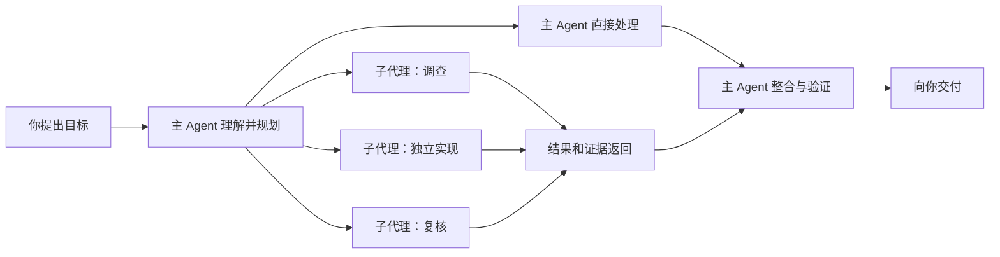

# Agent 协作与子代理

处理范围较大的任务时，主 Agent 可以把边界清楚的一部分工作交给子代理（Subagent），
自己继续协调其余工作，最后汇总和检查结果。

你只需说明目标和约束。主 Agent 会判断是否值得拆分；简单或紧密耦合的任务由它直接完成。

## 主 Agent 和子代理分别做什么

- **主 Agent**接收你的目标，维护整体计划，决定怎样拆分工作，并对最终答案负责。
- **子代理**拥有独立的模型上下文，专注一个有明确范围和交付物的任务，例如查找代码、
  研究外部资料、实现独立模块或复核结果。
- **主 Agent 负责整合。** 子代理返回结果后，主 Agent 检查证据、处理冲突、运行必要验证，
  再向你报告整个任务的结果。

## 什么时候适合拆分

子代理适合能独立说明、独立检查的工作：

- 同时盘点几个互不依赖的模块；
- 一边检查本地实现，一边研究上游文档；
- 把一个边界明确的实现交给独立工作区完成；
- 在主 Agent 多次尝试仍不确定时，请一个全新上下文提供第二意见；
- 实现完成后，让另一个上下文专门寻找遗漏。

如果下一步依赖刚刚得到的细节、改动会频繁触碰同一批文件，或者任务本身很小，拆分反而
增加沟通和合并成本。此时主 Agent 应留在当前上下文中完成。

## 上下文与文件隔离

“独立上下文”和“独立文件目录”是两件事：

1. **全新上下文**从一份明确任务说明开始，不继承整段主对话，适合研究、复核和避免旧假设
   干扰判断。
2. **从当前对话派生**会继承现有上下文，适合需要大量前情、但可以在后台独立推进的工作。
3. **独立 worktree**在单独的 Git worktree 中修改文件，适合范围较大、可能与主线并行写入
   或需要安全试验的实现。

子代理默认不一定拥有独立 worktree。多个 Agent 在同一工作区写文件时仍可能相互覆盖，
所以主 Agent 应划清各自负责的文件；不确定或改动较广时应优先隔离。

## 前台等待和后台协作

主 Agent 可以等待子代理返回后再继续，也可以让它在后台运行：

- **等待结果：**适合主 Agent 的下一步必须依赖该结果的情况。
- **后台运行：**适合互不依赖的调查或实现。主 Agent 可以同时完成其他工作，子代理结束后
  系统会发送完成通知，不需要反复查询状态。

桌面消息流按真实轮次显示子任务通知，不会把多个轮次合成一个持续运行的大轮次，也不会
回填较早的派出状态。环境区域仍会列出当前会话关联的子代理及其真实运行状态；主 Agent
收到结果后可继续整合，实际交付方式不受消息流展示影响。

停止当前回复会终止这次协作：正在运行的匿名 worker 树会被冻结或取消，尚未启动的排队
任务会被清除。它们之后不会自动恢复；如需继续，应发送新消息，让 Agent 根据当前文件
状态重新安排工作。

## 它与另外两种“后台工作”不同

| 能力 | 解决什么问题 | 由谁继续工作 | 什么时候结束 |
| --- | --- | --- | --- |
| 子代理 | 并行思考、调查、实现或复核 | 另一个 Agent 上下文 | 子任务完成、失败或被取消 |
| [后台命令](../reference/agent-command-system.md) | 运行测试、开发服务器、下载或交互程序 | 本机进程 | 进程退出或被停止 |
| [Automations](../automation/scheduled-tasks.md) | 在未来时间按计划启动任务 | 本机调度器届时创建 Agent 运行 | 单次执行结束，或重复任务暂停、删除、到期 |

这三种能力独立运行，分别处理 Agent 协作、本机进程和定时调度。

## 模型、权限与成本

- 子代理仍在当前 Wuu 的权限与工作区边界内运行，不会因为被拆出去就绕过本地保护。
- Wuu 可以给子代理选择单独配置的模型别名；未指定时使用当前的 worker 默认模型。
- 每个子代理都有独立模型上下文和调用，因此并行工作通常会增加模型请求和 token 消耗。
- 子代理返回的内容是待验证的交付物，不是自动可信的结论。涉及代码和外部资料时，主 Agent
  应保留可检查的文件、命令或链接证据。

## 当前使用边界

- 当前桌面体验以“主 Agent 自动判断是否委派”为主，暂不提供通过 `@agent` 手动点名子代理
  或切换主 Agent 的交互。
- 子代理用于有边界的临时任务，每次围绕明确的任务和交付物运行。
- Wuu 关闭、运行时重启或机器离线时，正在执行的子代理可能中断。
- 子代理完成后，仍要以工作区文件、diff 和验证结果作为最终成果依据。

如果你想理解子代理可能启动的命令如何被托管，继续阅读
[命令与后台任务](../reference/agent-command-system.md)。
