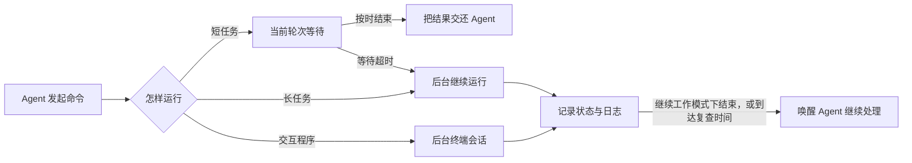

# 命令与后台任务

当你让 Wuu “跑一下测试”“启动开发服务器”或“执行这个脚本”时，Wuu 会根据命令的运行时间和交互需求选择执行方式，并持续记录进程状态和输出。

本文介绍 Agent 启动的本机进程，包括普通命令、后台任务和交互程序。具体工具名、参数和源码索引放在最后。

## 命令类型

Wuu 把命令分成三类：

1. **很快会结束的命令**，例如查看 Git 状态、运行一个测试或完成一次构建。Agent 留在当前工作轮次中等待结果。
2. **需要持续运行的任务**，例如开发服务器、watch 模式、大文件下载。Wuu 把它登记为后台任务，Agent 可以先做别的事。
3. **需要人机交互的程序**，例如安装确认、登录提示或 REPL。Wuu 为它保留可写输入，在支持的平台上提供真正的终端会话。

这三类任务都从同一个命令入口进入，并共享进程树控制和日志机制。普通命令在当前轮次中运行；超过等待上限后，Wuu 才把仍在运行的进程登记到后台任务管理器，不需要重新执行。



## 一条普通命令经历什么

以“运行当前模块的测试”为例，完整过程是：

1. **模型提出动作。** 模型说明要运行什么、在哪个目录运行，以及这次运行是局部检查还是完整检查。
2. **Wuu 判断能不能执行。** 系统检查当前 Agent 是否有命令能力、目录是否在可达工作区中、只读模式是否允许这个动作，并识别明显的敏感或破坏性命令。
3. **创建独立进程树。** 命令及其子进程与 Wuu 自身隔离。之后即使测试框架又启动多个 worker，Wuu 也能把整棵进程树一起停止。
4. **等待并收集结果。** Wuu 记录退出码、耗时、标准输出、错误输出和执行后的工作区版本。输出太长时，Agent 先看到摘要和尾部，完整日志留在本机。
5. **Agent 根据结果继续。** 成功时继续下一步；失败时读取错误证据、修改代码后再验证。系统会阻止 Agent 在代码没有变化时机械地反复运行同一条失败检查。

对用户来说，这个过程仍表现为一次连续对话；工具调用与结果的配对、并发顺序和日志落盘都由运行时处理。

## 如果命令比预计的更久

普通命令默认最多等待 5 分钟，Agent 可以为具体任务设置更短或更长的上限，但最长不超过 1 小时。

到达等待上限时，Wuu 会把仍在运行的进程转成后台任务：

- 原进程继续运行，不会重跑；
- 超时前已经产生的输出不会丢失；
- Agent 会拿到一个任务编号，可以查看进度或主动停止；
- Wuu 默认每 30 分钟检查一次被自动转后台的任务；
- 默认使用继续工作模式；任务自然结束后，Wuu 会尝试恢复所属对话并开启新的 Agent 轮次。

如果进程管理器或日志准备失败，Wuu 会停止超时命令。命令等待超时后，应根据返回的任务状态确认进程是否已经转到后台。

## 明确启动一个后台任务

开发服务器、watch 模式等已知的长任务，Agent 应从一开始就明确使用后台方式，而不是靠把普通命令的等待时间设得很短来让它被动转后台。

后台启动后，Agent 可以：

- 查看所有任务及其运行状态；
- 读取最新输出，或从上次读到的位置继续读取；
- 等待一小段时间，看是否出现新输出；
- 向程序发送输入；
- 调整定时复查频率；
- 停止整个进程树。

发送输入需要有效的 stdin 句柄。它适用于通过后台入口启动、并且 app-server 尚未重启的任务。普通命令超时转成的后台任务只保留观察和停止能力；app-server 重启后也无法继续发送输入。

读取输出时，Wuu 默认给出最后 32 KiB。需要完整内容时可以按字节位置向后翻页。等待新输出最长持续 5 分钟；出现新输出或任务结束时会立即返回。

系统刻意限制高频轮询。一个持续刷日志的任务不会让 Agent 一遍遍立即醒来；读取至少会停留约 5 秒。一个长期没有输出的任务更适合设置定时复查，让 Wuu 到点主动唤醒 Agent。

## 交互命令怎样工作

普通命令按非交互方式运行：编辑器、分页器和 Git 凭据提示会被关闭，避免 Agent 卡在一个看不见的问题上。

确实需要交互时，Agent 会把程序作为后台终端启动，再发送输入。例如：

1. 启动安装程序并等待它显示确认问题；
2. 读取问题；
3. 写入 `y` 和换行；
4. 继续读取，直到程序结束。

macOS 和 Linux 可以为这类程序创建 PTY，行为更接近真实终端。Windows 当前会退回普通输入管道，因此某些严格要求终端的程序可能表现不同。无论哪种模式，app-server 重启后都不能恢复原来的输入句柄。

## 后台任务如何唤醒 Agent

后台任务有两种结束方式：

- **继续工作：** 默认方式。任务自然结束后，Wuu 把退出状态和最后一段输出作为一条系统生成的消息送回所属对话，并尝试开启新的 Agent 轮次。所属对话必须仍然存在且能够恢复。
- **静默结束：** 适合不应再次唤醒 Agent 的服务。任务仍可被查看和停止，但退出时不创建新轮次。

进程管理器会把待发送的完成结果写入本地记录，再发送即时事件。如果即时事件因为队列已满而丢失，app-server 会重新扫描记录；对话恢复时也会补查。已删除或无法恢复的对话不会开启新的 Agent 轮次。

定时复查使用同一套机制。到点后，Agent 收到当前状态和日志尾部，可以选择干预、调整下一次复查，或什么也不做。任务结束后，复查自动取消；继续工作模式随后处理完成结果。

## 用户和桌面怎样看到这些任务

命令执行属于 Go core，而不是 Electron 专属能力。app-server 提供按对话隔离的进程接口，让当前桌面或未来的 IDE shell 可以：

- 列出这个对话拥有的任务；
- 读取输出；
- 在输入句柄仍有效时写入输入，并调整仍连接的终端大小；
- 停止任务。

服务端会检查任务归属，一个对话不能读取或操作另一个对话的进程。模型使用的命令工具和人类使用的进程界面最终操作的是同一个进程管理器，不会各自维护一套状态。

当前桌面的任务面板大约每 1.5 秒向 app-server 查询一次进程状态；命令调用和完成续转通过正常的对话事件显示。因此，面板状态可能比实际进程晚一个轮询周期。

## 命令在哪里运行

### 工作目录

命令默认在当前工作区根目录执行。Agent 可以指定子目录，但目录必须存在，并且通常不能逃出当前可达工作区。隔离 worker 会先通过同样的边界检查，再把路径映射到自己的 worktree。

每次普通命令都会启动一个新的 shell。上一条命令中的 `cd`、临时环境变量或 alias 不会自动延续；需要连续状态时，应写在同一条脚本中，或使用显式的交互后台会话。

### Shell 和环境

- macOS 和 Linux 使用 Bash 登录 shell，因此用户配置的 PATH 和版本管理器通常可用。
- Windows 使用 Git Bash；没有找到时会提示安装 Git for Windows 或配置 Bash 路径。
- 普通命令会关闭编辑器、pager、颜色和终端凭据提示，并移除可能来自 app-server 构建环境的 `GOROOT`。
- 显式后台任务目前更直接地继承宿主环境，没有完全复用普通命令的环境清理。

普通命令和显式后台任务使用相同的 Bash 语法和进程管理能力，但启动环境还不完全一致。

## 安全模型：直接执行，但有硬边界

Wuu 当前没有“每条高风险命令都弹窗确认”的审批流。权限判断只有允许或拒绝：

- 标准 Agent 在可达工作区内可以直接执行命令；
- 只读 Agent 可以观察，但不能运行被判断为会修改状态的命令；
- 工作目录越界会直接拒绝；
- 额外 guard 可以加入不可绕过的拒绝规则，但不能转成人工审批。

系统会分析命令是否只读、是否适合并行、是否可能读取密钥、是否包含破坏性 Git 操作、下载安装或外部修改。这些信息用于调度、展示和边界判断。Bash 仍是通用解释器，静态分析无法提供操作系统级隔离。

工作区边界主要约束命令的启动目录。子进程仍可能使用绝对路径、访问网络或启动其他程序。需要强隔离时，应使用容器、受限系统用户或操作系统提供的 sandbox。

停止任务时，Wuu 会先核对进程的启动身份和进程组，避免操作系统复用旧 PID 后误杀无关程序。确认归属后先请求温和退出，约 2 秒后仍未结束才强制杀掉整棵进程树。

## 日志与敏感信息

普通命令返回给模型的输出有大小限制，并经过脱敏；完整的普通命令日志也以脱敏形式写入当前会话目录。

后台任务不同：为了能持续追加和跨轮次读取，原始命令记录和合并输出保存在工作区运行时目录，读取并返回给模型时才脱敏。这意味着：

- 不要把密钥直接拼进命令行；
- 不要让程序无必要地把 secret 打到 stdout 或 stderr；
- 当前后台日志没有大小上限和自动保留期，高输出长任务可能持续占用磁盘。

后台日志会把标准输出和错误输出合并，之后无法再还原两个通道。普通命令虽然只向模型返回有限内容，但执行期间会先把完整输出收进内存，异常高输出也可能增加 Wuu 的内存占用。

## 进程能活多久

后台任务的记录和日志保存在本机。app-server 重启时，仍在运行的进程可以继续存在；新的进程管理器会根据 PID、进程组和启动身份重新发现并停止它们。

重启后无法恢复原来的终端、stdin 或 Go 进程句柄，也可能无法取得可靠的退出码。跨重启任务不提供重启策略、健康检查或退避机制。

正常关闭 app-server 时，Wuu 会尝试停止默认方式启动的后台任务。删除 thread、关闭 subagent 或从缓存移除 thread 时，它们启动的任务可能继续运行；后台进程也不会让 Desktop 持续保活 app-server。

## 当前最重要的限制

1. 普通命令和显式后台命令的启动环境还不完全一致。
2. 后台日志没有大小上限和自动清理期限。
3. 跨 app-server 重启只恢复观察和停止，不恢复交互控制。
4. Windows 没有真正的 PTY，交互兼容性弱于 macOS 和 Linux。
5. 命令分类是保守的静态判断，不是操作系统级 sandbox。
6. thread 删除、subagent 关闭和 host 生命周期还没有形成完整的进程清理闭环。

## 给 Agent 的操作速查

正文中的行为在模型工具里对应以下操作名。只有在调试工具调用或协议时才需要关心这些字段。

| 想做什么 | 工具操作 |
| --- | --- |
| 运行并等待结果 | `bash`，`action=run` |
| 启动长任务或交互程序 | `action=start_background` |
| 查看后台任务 | `action=list_background` |
| 读取输出或有限等待 | `action=read_background` |
| 写入终端输入 | `action=write_background` |
| 停止任务 | `action=stop_background` |
| 修改定时复查 | `action=update_background` |

普通命令默认等待 300 秒，最长 3600 秒；后台输出默认读取 32 KiB；单次等待后台新输出最长 300 秒；定时复查间隔为 1 到 1440 分钟。

## 实现索引

如果要修改这套系统，可以从下面几处进入：

- `internal/tools/tool_bash.go`：模型看到的统一命令入口
- `internal/tools/tool_shell.go`：普通命令、工作目录、环境、分类和超时转后台
- `internal/tools/boundary.go`：允许或拒绝的工作区边界
- `internal/process/command.go`：进程树启动与停止
- `internal/process/manager.go`：后台任务、日志、输入、复查和持久记录
- `internal/shellpath/`：macOS、Linux 和 Windows 的 Bash 解析
- `internal/agent/loop.go`：模型工具调用与结果回填
- `internal/appserver/process_notifications.go`：完成通知和 Agent 续转
- `internal/appserver/process_handlers.go`：桌面等 shell 使用的进程接口

核心测试可以这样运行：

```bash
go test ./internal/tools ./internal/process ./internal/shellpath ./internal/agent ./internal/appserver
```
